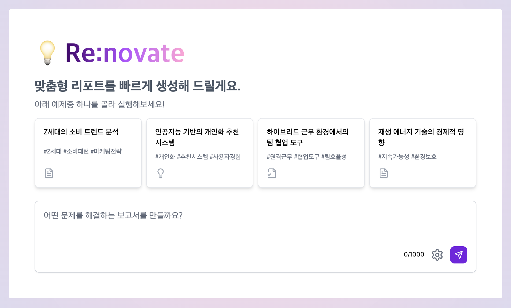
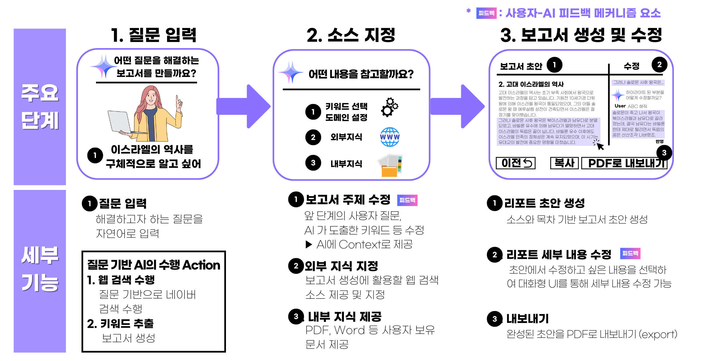

# Re:novate Project


Re:novate의 배포된 버전은 다음 링크에서 확인할 수 있습니다.  [https://re-novate.kro.kr](https://re-novate.kro.kr)


## 프로젝트 개요

✨Re:novate는 AI와 사용자 간의 상호작용을 통해 보고서 작성 프로세스를 혁신🚀하는 것을 목표로 합니다.

-  **AI 협업 보고서 생성**: 사용자 입력과 AI 제안을 결합하여 고품질 보고서 작성
-  **실시간 편집 및 개선**: AI의 실시간 피드백을 통한 보고서 품질 향상
-  **다양한 데이터 소스 통합**: 내부 파일, 입력한 url, 웹검색(뉴스, 블로그, 웹 문서) 등 다양한 출처의 정보를 활용

이 프로젝트는 생성형 AI의 활용 방식에 혁신적인 변화를 가져오고, 사용자들의 AI 이용 행태를 개선하는 것을 궁극적인 목표로 합니다.

### 기술 스택

- Frontend: Next.js 14
- Styling: Tailwind CSS
- State Management: Recoil
- API: RESTful API with Axios
- AI Integration:   
    ✨Upstage solar, document-parse  
    OpenAI GPT-4, DALL-E

## 설치 및 실행 방법

### 요구사항

- Node.js (v14.0.0 이상)
- npm (v6.0.0 이상) 또는 yarn (v1.22.0 이상)

### 설치 단계

1. 리포지토리 클론:
   ```bash
   git clone https://github.com/muniv/re-novate.git
   cd re-novate
   ```

2. 환경 변수 설정:
   `.env` 파일을 프로젝트 루트에 생성하고 필요한 환경 변수를 설정합니다:
   ```
   UPSTAGE_API_KEY=…
   OPENAI_API_KEY=sk-…
   NEXT_PUBLIC_MAIN_API_SERVICE_TYPE  => solar, openai 
   NAVER_CLIENT_ID=…
   NAVER_CLIENT_SECRET=…
   ```

3. 의존성 설치:
   ```bash
   npm install
   # 또는
   yarn install
   ```

### 개발 서버 실행

```bash
npm run dev
# 또는
yarn dev
```

애플리케이션은 기본적으로 http://localhost:3000 에서 실행됩니다.

### 프로덕션 빌드

```bash
npm run build
npm start
# 또는
yarn build
yarn start
```

### 배포된 버전

Re:novate의 배포된 버전은 다음 링크에서 확인할 수 있습니다: [https://re-novate.kro.kr](https://re-novate.kro.kr)


## LLM 활용 세부 사항

Re:novate는 다양한 단계에서 LLM(Large Language Model)을 활용하여 사용자 경험을 향상시켰습니다.

1. **질문 최적화** 🔍
   - 사용자의 초기 질문을 보고서 생성에 적합하게 재구성
   - 사용 모델: ✨Upstage Solar 또는 GPT-4

2. **키워드 추천** 🏷️
   - 질문을 분석하여 보고서 방향 설정을 위한 키워드 제안
   - 사용 모델: ✨Upstage Solar 또는 GPT-4

3. **문서 파싱** 📄
   - 사용자 업로드 파일을 분석하여 관련 컨텍스트 추출
   - 사용 모델: ✨Upstage Document-Parse

4. **보고서 초안 생성** 📝
   - 선택된 컨텍스트를 바탕으로 구조화된 보고서 초안 작성
   - 사용 모델: ✨Upstage Solar 또는 GPT-4

5. **프롬프트 번역** 🌐
   - 보고서 표지 이미지 생성을 위한 프롬프트 번역
   - 사용 모델: ✨Upstage Solar 또는 GPT-4

6. **대화형 편집** 💬
   - 사용자 요청에 따른 보고서 내용의 실시간 수정 및 개선
   - 사용 모델: ✨Upstage Solar 또는 GPT-4

*.env 에서 NEXT_PUBLIC_MAIN_API_SERVICE_TYPE 을 수정하여 LLM을 선택할 수 있습니다.

## 사용 방법
데모 영상: https://www.youtube.com/watch?v=1AmK8p4tvVE

### 간단 가이드
1. 리포트로 작성하고 싶은 질문 작성  
1-1. '보고서 생성 세부설정'에서 키워드 설정, 표지 이미지 생성 여부, 참고할 url, 파일 업로드 설정
2. 리포트 생성을 위해 활용할 데이터 선택
3. AI가 작성한 리포트 초안을 확인  
3-1. 수정이 필요한 부분을 클릭한 후 대화형으로 수정 가능
3-2. 최종 리포트는 pdf로 다운로드 가능




### 연락처
문의사항이 있으시면 dmtgjh@naver.com으로 연락 주시기 바랍니다.
